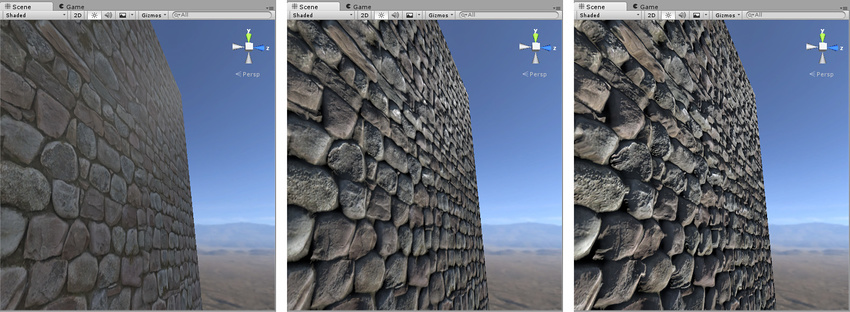

# 视差贴图(Parallax Map)
* 凹凸贴图通过阴影提供了表面的凹凸感, 但是无法处理遮挡关系
* 视差贴图(也叫作高度贴图), 通过改变纹理的UV来提供遮挡的效果
* 如下图, 分别是无效果, 使用了凹凸贴图, 使用凹凸贴图和视差贴图的效果
  

图片来自: Unity Manuel - [Heightmap](https://docs.unity3d.com/Manual/StandardShaderMaterialParameterHeightMap.html)

# 基本原理
1. UV与切线空间
   * 切线空间的3个坐标轴对应TBN: 切线, 副法线和法线
   * X轴, 也就是切线, 对应UV的U
   * Y轴, 也就是副法线, 对应UV的V
2. 一个最简单的情况
   * 一个平面, 需要整体上升高度h
   * 那么平面上的一个点A, 在视角View下看到的内容应该是点A'(也就是点B)的内容, 如下图
   
   

   * 此时只需要将U沿X方向移动(Vx / Vz) · h即可
   * 同理, V沿Y方向移动(Vy / Vz) · h
   * h由视差贴图(高度贴图)提供, 0\~1的值要先映射为-0.5\~0.5, 代表凹凸的程度
   * 另外使用一个缩放值来控制高度
3. 偏移量限制(Offset Limit)
   * 视角接近平行于表面时, 此时Vz将趋于0, Vx / Vz将趋于无穷大
   * 可以对公式进行修改来避免这个问题: Vx / (Vz + bias)
   * Unity将这个bias设为0.42

# 陡峭视差映射(Steep Parallax Mapping)
   * 对于Unity来说到上面这一步就已经结束了, 但是高度图不可能是等高的, 实际上的高度图是下面这样的. 对高度图采样获得的是H(A), 计算偏移应该使用H(B).

   * 当高度变化很大时, 如下图, 此时H(A)和H(B)相差过大就会出现问题

   * 主要思想是多次对高度图进行采样, 来逼近H(B)

图片来自: Jim's GameDev Blog - [视差贴图（Parallax Mapping）](https://chengkehan.github.io/ParallaxMapping.html)
   * 不管选择交点的左侧还是右侧高度, 都会造成分层的情况, 采样次数越少, 分层越明显, 一个优化是对左右采样的高度值进行插值, 这个技术叫做: 视差遮蔽映射(Parallax Occlusion Mapping)

# 参考
* [Heightmap](https://docs.unity3d.com/Manual/StandardShaderMaterialParameterHeightMap.html), Unity Manuel
* [基础渲染系列（二十）——视差（基础篇完结）](https://mp.weixin.qq.com/s/kQf_UHWzOThBodpKlr_bvw), [Catlike Coding](https://catlikecoding.com/), [放牛的星星](https://www.zhihu.com/people/niuxingxing)翻译
* [视差贴图（Parallax Mapping）](https://chengkehan.github.io/ParallaxMapping.html), Jim's GameDev Blog
* [视差贴图](https://learnopengl-cn.github.io/05%20Advanced%20Lighting/05%20Parallax%20Mapping/), [LearnOpenGL](https://learnopengl.com/), [LearnOpenGL中文化工程](https://github.com/LearnOpenGL-CN/LearnOpenGL-CN)
* [视差贴图（Parallax Mapping）](https://blog.csdn.net/happykocola/article/details/72812081), HappyKocola
* 图片使用[GeoGebra](https://www.geogebra.org/)制作
