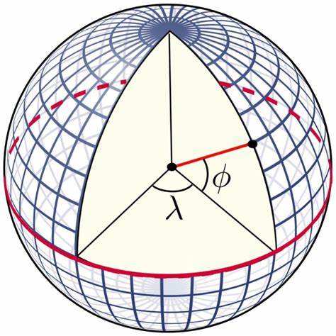

# 球面映射(Sphere Map)
* 球面映射是环境映射(Environment Mapping)的一种实现方式, 类似的还有立方体映射(Cube Map)
* 大多数的全景图(Panorama)都是使用了球面映射
* 球面映射使用的投影方式叫做等量矩形投影([Equirectangular project](https://mathworld.wolfram.com/EquirectangularProjection.html)), 缩写为ERP
* 等量矩形投影是一个特殊的等距圆柱投影([Cylindrical Equidistant Projection](https://mathworld.wolfram.com/CylindricalEquidistantProjection.html)), 等距圆柱投影定义如下
   * x=(λ −λ<sub>0</sub>)cos⁡φ<sub>1</sub>
   * y=φ
   * 球面上：λ是经线，φ是纬线，φ<sub>1</sub> 是标准纬线，λ<sub>0</sub>是中心子午线 
   * 平面上：x是水平坐标，y为垂直坐标。
   * φ<sub>1</sub> = 0 时, 就是等量矩形投影  
   
* 从公式中可以看到
   * x的范围在[0, 2π], 整体是2π
   * y的范围在[-π/2, π/2], 整体是π
   * 所以球面映射纹理的宽高比都是2:1
* 采样
   * 在Unity内置的着色器Skybox/Panoramic中, 球面映射被称作Latitude Longitude Layout, 主要的代码在ToRadialCoords, 传入的参数是顶点在裁剪空间中的坐标, 返回是纹理UV  
   ```cg
    inline float2 ToRadialCoords(float3 coords)
    {
        float3 normalizedCoords = normalize(coords);
        // 根据y的反余弦计算纬度, 最后的结果在[0, +π], 最后变换到(1, 0), 对应uv.y
        float latitude = acos(normalizedCoords.y);
        // 根据z/x的反切计算经度, 最后的结果在(−π, +π), 最后变换到(0, 1), 对应uv.x
        float longitude = atan2(normalizedCoords.z, normalizedCoords.x);
        float2 sphereCoords = float2(longitude, latitude) * float2(0.5/UNITY_PI, 1.0/UNITY_PI);
        return float2(0.5,1.0) - sphereCoords;
    }
   ```
   * 一个光线追踪代码, 含义是一样的
   ```cg
    // Sample the skybox and write it
    float theta = acos(ray.direction.y) / -PI;
    float phi = atan2(ray.direction.x, -ray.direction.z) / -PI * 0.5f;
    return _SkyboxTexture.SampleLevel(sampler_SkyboxTexture, float2(phi, theta), 0).xyz;
   ```
* 模型如果要作为天空盒, 本身不需要UV, 也不需要是球形, 完全可以是天穹(Skydome), 或者其他形状
* 如果摄像机的FOV是45°, 那么在X轴方向采样的像素相当于纹理的1/8, 如果原图是4096x2048, 那么全屏显示的时候, 只有512像素被采样到, 对于大多数2K屏幕来说精度是非常糟糕的
* 使用立方体映射, 能获得更高一些的分辨率, 有时候还能获得更好的压缩效果, 因为球面映射不是正方形的
* 可以通过修改着色器, 或者修改模型UV的方式, 将球面映射贴图贴到模型上, 然后摄像机可以离开中心点自由移动. 一种常见做法是绕中心旋转的摄像机, 此时会出现几个问题, 地面如果有线条, 会出现弯曲的情况. 如果摄像机贴近地面, 与地面角度较小时, 精度会下降的十分厉害
