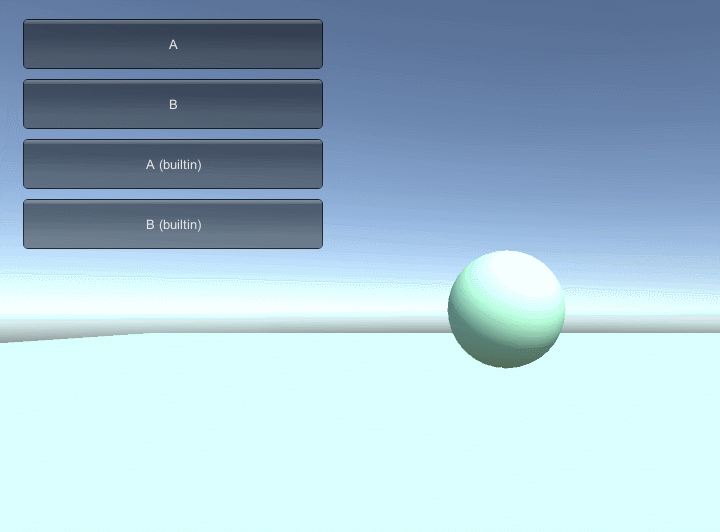

# 着色器插值版生成器

Unity3D自带了一个材质的插值功能[Material.Lerp](https://docs.unity3d.com/ScriptReference/Material.Lerp.html), 原理是对材质所有的颜色和浮点类型参数进行插值. 如果要实现一个略有变化的效果, 如从某个点开始向外扩展, 或者从某个平面向外扩展的效果, 就需要另外改写Shader. 这个工具的主要功能是简化生成能进行插值的着色器的步骤.

## 如何使用

1. 设定一个存放插值着色器的目录, 因为它们都需要引用Lerp Helper.cginc, 在示例中, 它们都被放在了Example/Shaders
1. 右键单击目标着色器, 示例中是Example/Shaders/Emissive, 选择Create Shader Lerper
1. 这个命令会自动生成EmissiveLerper.shader和Emissive Lerper.prefab两个文件
1. EmissiveLerper.shader
   1. 这个插值版着色器基本复制了原着色器, 并做了以下修改
      1. 对其中所有的颜色和浮点类型属性生成一个有LerpTo后缀的变量
	  1. 将这些变量的使用修改成LERP_PROP(prop)
   1. 现在要打开这个着色器做一些修改.
      1. 在Input结构中加入float3 worldPos的定义
      1. 加入#include "Lerp Helper.cginc";
      1. 在函数开始的地方加入 INIT_LERP;
   1. 然后希望可以编译通过, 因为我并没有完成一个ShaderLab的解析器
   1. 一些要修正的问题和优化
      1. 如果属性中有类似于Tex/Tex2之类名字中包含其他变量名的情况会替换错误
	  1. 如果某个变量有多次引用, 可以先保存成一个变量, 否则会多次调用Lerp
1. Emissive Lerper.prefab, 
   1. 挂载了MaterialLerper, 并且自动填写了颜色/浮点/纹理类型的属性名
   1. 将它拖入场景, 设定描绘器和使用了插值版着色器的材质
   1. 调用MaterialLerper.Lerp(Material targetMaterial)
   1. 渐变结束之后, 会把材质设为目标材质
1. Lerp Helper.cginc
   1. 计算顶点到原点距离时使用了模型空间, 如果原点在模型内, 这样将模型缩放后能保证渐变效果一样. 但如果屏幕中有大大小小多个模型的实例, 原点又在模型外部, 效果就会不对.
   1. 扩展的效果, 如从某个点开始向外扩展, 或者从某个平面向外扩展的效果也在这里修改.

## 预览
